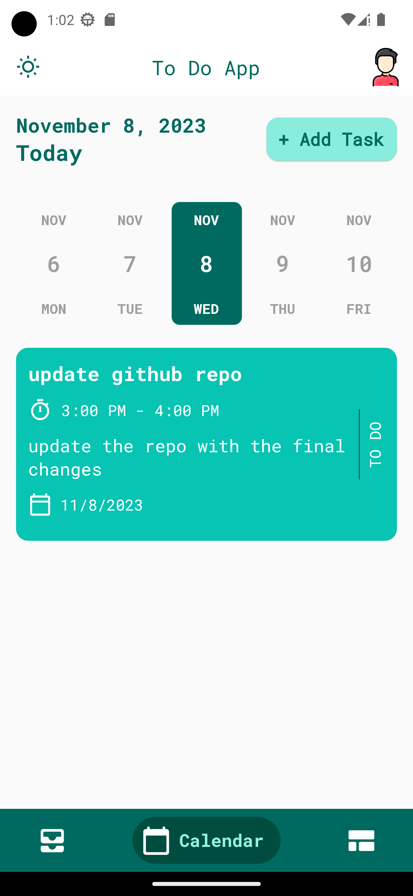

# To-Do App

<p align="center"></p>

## Overview

This To-Do App is a powerful and flexible task management application that allows you to efficiently manage your tasks and stay organized. Whether you want to keep track of personal to-dos or manage work-related tasks, this app has got you covered.

## Features

- **Task Management**: Create, edit, and delete tasks effortlessly.
- **Category Management**: Organize tasks into categories with custom colors.
- **Task Details**: Add essential details like task name, description, date, start time, end time, category, and color.
- **Task Status**: Easily toggle tasks between "Completed" and "To-Do" states.
- **Dark Mode Support**: Seamlessly switch between light and dark themes.
- **Local Data Storage**: Utilizes Hive as a local database to store your essential task data.
- **Category Task List**: View all tasks associated with a specific category.

## Screenshots

<div align="center">
  
  
  
  
  
  
  
  
  
  
  
  
  
  
  
  
  
  
  
</div>

## Getting Started

To get started, follow these steps:

1. Clone the repository using the following command:

   ```bash
   git clone https://github.com/Mohamed-code-13/To-Do-App-Flutter
   ```

2. Navigate to the project directory:

   ```bash
   cd To-Do-App-Flutter
   ```

3. Install dependencies:

   ```bash
   flutter pub get
   ```

4. Run the app:

   ```bash
   flutter run
   ```

## State Management with Bloc (Cubit)

This app utilizes the Bloc (Cubit) pattern for efficient state management. It ensures a clean and organized separation of concerns, making the app more maintainable and scalable.

## Local Data Storage with Hive

This App leverages the power of Hive, a lightweight and efficient NoSQL database for Flutter, to provide seamless and reliable local data storage. Hive is used to store all the essential task and category information right on your device, ensuring that your data is readily available even without an internet connection.

## License

This project is licensed under the MIT License.
